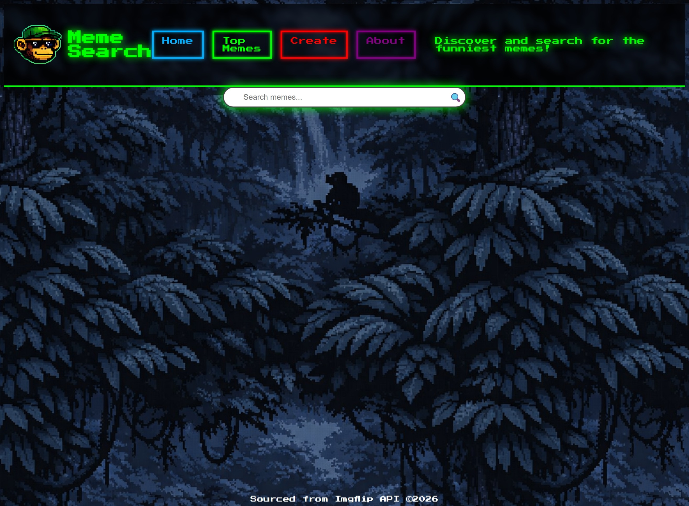
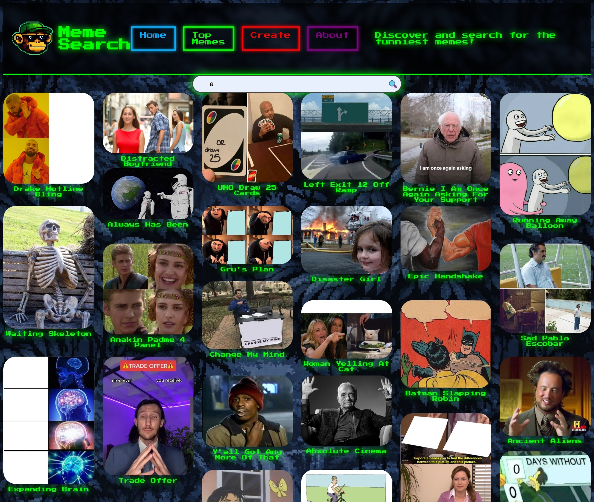

# Meme-Search
<pre> <code>
 __  __                         _____                            _     
|  \/  |                       / ____|                          | |    
| \  / | ___  _ __ ___   ___  | (___   ___  ___ _   _ _ _  ____ | |__  
| |\/| |/ _ \| '_ ` _ \ / _ \  \___ \ / _ \/ ___ |  | '__|/  __|| '_  \ 
| |  | | |__/ | | | | | ||__/  ____) | |__/ (__| |_ | |   | |__ | | | |
|_|  |_|\___/|_| |_| |_|\___| |_____/ \___|\___|\__||_|    \___||_| |_|
</code></pre>                                                                 
                         Meme Search Engine
                         ------------------

Overview:
---------
Meme Search Engine is a simple web application that allows users to search for memes
using the Imgflip API. It displays meme results in a grid layout and includes options
to view top memes, create memes, and read an About section. The design uses a retro
pixel aesthetic inspired by early web pages and arcade interfaces.

User stories:
-------------
- As a gangsta user, I want to be impressed when the page loads and see something retro.
- as a gangsta user, I want to look up memes like a modern search engine with functional icons.
- as a gangsta user, I want to laugh, be inspired to create memes to make others laugh.
Wireframes:
-----------
BEHOLD! some wireframes I came up with whilst peruzing the interwebs for inspiration.

### Desktop view
.drawio.png)
### Results page

### Mobile page
.drawio.png)

Screenshots:
------------
### Desktop view

### Results page

### Mobile page

Features:
---------
- Search memes by keyword
- View top memes from the Imgflip API
- Create memes via Imgflip Meme Generator link
- Responsive layout for desktop and mobile
- Pagination and infinite scroll support
- “No Results Found” message with sad monkey image
- About section describing project purpose
- Footer showing API source and copyright

Technologies Used:
------------------
- HTML
- CSS / SCSS
- JavaScript
- Imgflip API

File Structure:
---------------
 <pre> <code>
 index.html
 css/
  style.css
  style.scss
 js/
   main.js
 Assets/
  Logo.png
  sad-monkey.png
  </code></pre>

How It Works:
-------------
1. User must click or press to render home page, then enter a search term in the search bar.
2. JavaScript sends a request to the Imgflip API.
3. The API returns meme data in JSON format.
4. The app filters and displays memes in a grid.
5. If no memes match, a “No Results Found” message with a sad bouncing monkey appears.
6. The Home button clears results and restores the footer text.
7. Create sends user to ImgFlip page to create their own memes
8. Top memes loads most popular memes from API site.
9. About when clicked renders for user a fun message from creator.

API Reference:
--------------
Imgflip API: https://api.imgflip.com/get_memes

Responsive Design:
------------------
- Uses CSS Grid and Flexbox.
- Media queries for 480px and 320px screen widths.
- Layout adjusts for mobile devices.

Fonts:
------
Google Fonts: Orbitron and Press Start 2P.

Future Improvements:
--------------------
- Add user login and favorites list.
- Implement meme category filters.
- Add light mode toggle.
- Include meme upload feature.
- Add animated transitions between sections.

##Skills obtained:
------------------
During the course of putting together this Meme search webpage I obtained the knowlede to work with public API, parse JSON data returned from an external source. I had a challenging but insightful experiance using JavaScript to manipulate the DOM and mess with content based on user input. I had an even wonderful time creating a responsive layout using CSS grid, flexbox, and media queries.

I understand small web aplication through this project, file structures, Git hub version control, SCSS as a preprocessor compiling into CSS. I'll have to say innerstanding breakpoints and mobile layouts sure help grasp the concept of responsive design.
I hade many bugs along the way but resolving each one lead to a better version of my vision.

## Comments
-----------
This project was fun, consuming at times considering I had other responsibilities. It truly allowed me to utilize my creative thinking and design skills. Once I had the wire frame figured out the rest was just a goal to traverse through code, HTML reminds me of MySpace days and JS is very obtuse but managable. I stole the idea of infinite scroll from classmate Amanda, the monkey theme helps pull my interest in these projects, as I often suffer from motivation problems. Fade in and out, crying monkey, text-shadow, icons in search bars, neon in a dark gloomy background were all fun experiments to explore styling and scripts.

------------------------------------------------------------
   Project: Meme Search Engine
   Author : Corbin
   API    : Imgflip Meme API
   Year   : 2026

   Thank you for reviewing this project.
   May your memes be dank and your searches successful.
------------------------------------------------------------

License:
--------
Open source for educational use.
